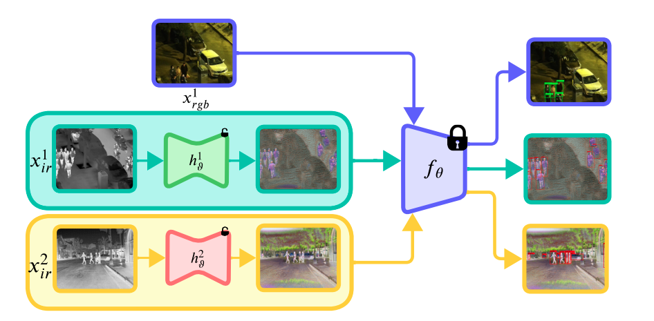

# ModTr [ECCV2024]

This repository contains the code used for Modality Translation for Object Detection Adaptation Without Forgetting Prior Knowledge 🔗 by Heitor Rapela Medeiros, Masih Aminbeidokhti, Fidel Guerrero Pena, David Latortue, Eric Granger, Marco Pedersoli (ECCV 2024). 

P.S. The code will be released soon. Max one week after the camera-ready, because I am working on another project right now.

## References

Thanks to the great open-source community that provided good libraries.