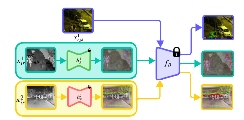

# ModTr [ECCV2024]

This repository contains the code used for **Modality Translation for Object Detection Adaptation Without Forgetting Prior Knowledge** 🔗 by Heitor Rapela Medeiros, Masih Aminbeidokhti, Fidel Guerrero Pena, David Latortue, Eric Granger, Marco Pedersoli (ECCV 2024).

# News

 - The code is released.
 - New updates will come in the following days!
 - If you find any problem or have any questions, please feel free to contact us!

## Installation (Python 3.8.10)

    conda create -n modtr python==3.8.10
    pip install -r requirements.txt

## How to train ModTr?

    # Modtr Cross with Faster R-CNN 
    CUDA_VISIBLE_DEVICES=0 python main.py --modality ir --wandb-project modtr --wandb-name modtr_fasterrcnn_llvip_200ep_seed123_fusecross --detector fasterrcnn --dataset llvip --epochs 200 --batch 8 --seed 123 --directly-coco --fuse-data cross

    # Modtr Cross with FCOS
    CUDA_VISIBLE_DEVICES=0 python main.py --modality ir --wandb-project modtr --wandb-name modtr_fcos_llvip_200ep_seed123_fusecross --detector fcos --dataset llvip --epochs 200 --batch 8 --seed 123 --directly-coco --fuse-data cross

    # Modtr Cross with RetinaNet
    CUDA_VISIBLE_DEVICES=0 python main.py --modality ir --wandb-project modtr --wandb-name modtr_llvip_200ep_seed123_fusecross --detector retinanet --dataset llvip --epochs 200 --batch 8 --seed 123 --directly-coco --fuse-data cross

    # For flir, just change the dataset flag: --dataset flir

## References

Thanks to the great open-source community that provided good libraries.

The code is based on our previous work [HalluciDet](https://github.com/heitorrapela/HalluciDet)